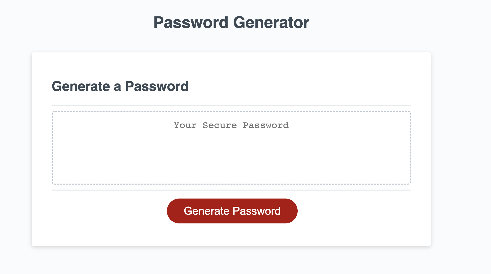
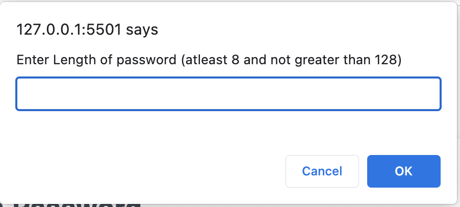
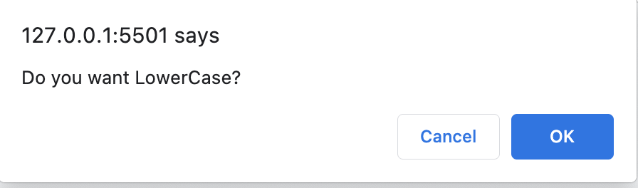
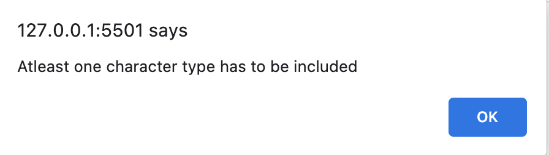

# Random Password Generator - Javascript

* Users should be able to randomly generate a password that meets certain criteria so that a strong password with greater security is generated. 

## Acceptance Criteria 

Generate a new, secure password:
WHEN user clicks generate a password button, THEN a series of prompt message will be displayed to get the criteia for password.
WHEN prompted to gather the criteria, THEN user selects criteria to be included. 
WHEN prompted for length of password, THEN user enters length of atleast 8 characters and no more than 128 characters.
WHEN prompted for character types to inclue, THEN I confirm whether or not to include lowercase, uppercase, numeric, and/or special characters. 
WHEN users selects prompt, THEN input is validated and at least one character type should be selected.
WHEN all prompts are answered and validated, THEN a password is generated that matches the user selcted criteria. 
WHEN the password is generated, THEN the password is either displayed in an alert or written on page

## Mock-Up screens:

